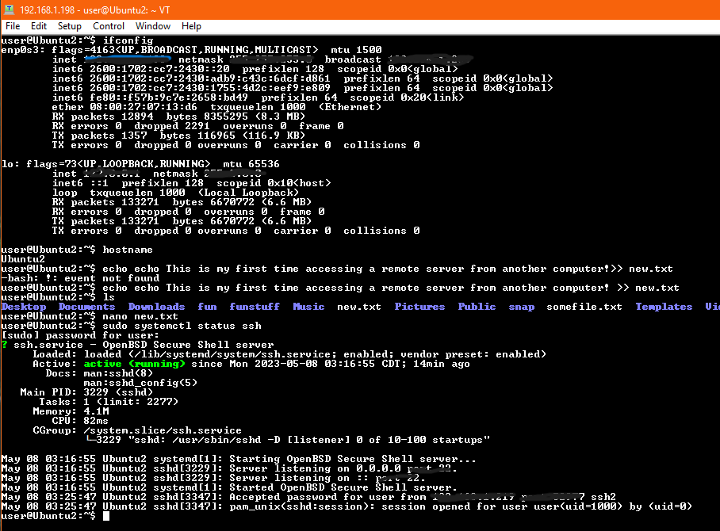

# remote-access-VM
Established a Linux virtual machine, installed Open Source Initiative-approved Ubuntu images, and remotely accessed the virtual machine from a separate computer.

![screenshot] (Screenshot (22).png)
![screenshot] (Screenshot (23).png)
![screenshot] (Screenshot 2023-05-08 031428.png)
![screenshot] (Screenshot 2023-05-08 031443.png)
![screenshot] (Screenshot 2023-05-08 031456.png)
![screenshot] (Screenshot 2023-05-08 031506.png)
![screenshot] (Screenshot 2023-05-08 033321.png)
